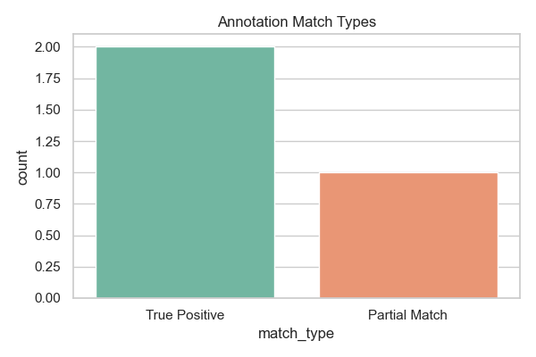
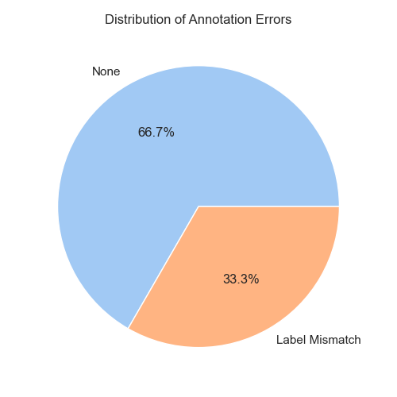

# 🩺 Clinical NLP Annotation QA Pipeline

This project is a complete pipeline to **compare human and machine-labeled clinical text annotations**, identify mismatches, classify errors, compute metrics, and generate insightful visualizations.

## 🔍 Use Case

In clinical NLP, it's crucial to ensure the quality of machine-generated annotations by comparing them with expert-labeled (human) data. This toolkit automates that process.

---

## 📁 Project Structure

| File                          | Description                                      |
|-------------------------------|--------------------------------------------------|
| `qa_pipeline.ipynb`           | Main notebook for running the QA pipeline       |
| `human_annotations.csv`       | Ground truth human annotations                  |
| `machine_annotations.csv`     | Machine-predicted annotations                   |
| `qa_report.csv`               | Final evaluation report with match/error types  |
| `match_type_bar_chart.png`    | Visualization of annotation match categories    |
| `error_type_pie_chart.png`    | Visualization of error distribution             |
| `requirements.txt`            | Dependencies for running this project           |
| `README.md`                   | Project overview and documentation              |

---

## ⚙️ Features

- ✅ Span-based entity alignment
- ✅ Match type classification:
  - True Positive
  - Partial Match
  - False Positive / False Negative
- ✅ Error type detection:
  - Label Mismatch
  - Missing or Extra Entity
- ✅ Precision, Recall, F1 Score calculation
- ✅ Visual output (bar + pie charts)

---

## 📊 Sample Visualizations

### Match Type Distribution


### Annotation Error Types


---

## 🧪 Example Output (`qa_report.csv`)

| text     | human_label | machine_label | match_type    | error_type     |
|----------|-------------|----------------|---------------|----------------|
| Aspirin  | DRUG        | DRUG           | True Positive | None           |
| 500 mg   | DOSAGE      | STRENGTH       | Partial Match | Label Mismatch |
| headache | CONDITION   | CONDITION      | True Positive | None           |

---

## 📦 Install Dependencies

```bash
pip install -r requirements.txt
```

---

## 👨‍⚕️ Author

**Samuel Njeru**  
Clinical NLP Annotation & QA Specialist  
🔗 [GitHub](https://github.com/samuelnjerungari)

---

> 📌 Ready to plug into real-world annotation pipelines for quality assurance tasks!
